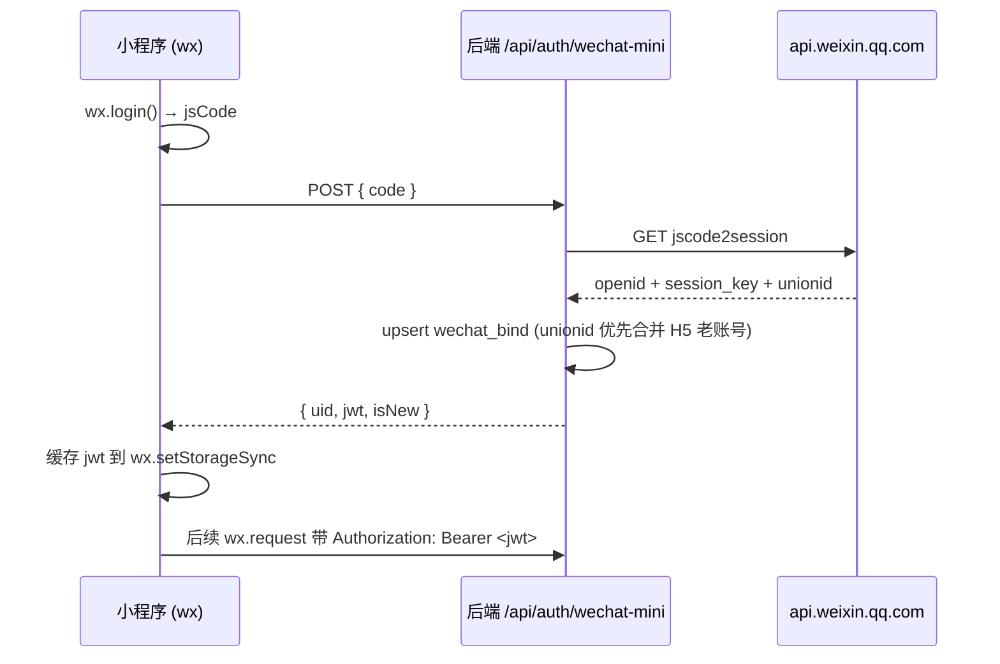

# `miniprogram/` — 福小运 微信小程序前端骨架

> 这是**最小骨架**，让小程序能登录到本仓库 `app/api/auth/wechat-mini` 并打通到 H5 后端 API。完整 chat 流式 / 八字 / 梅花 UI 等正在迁移中。

## 目录结构

```
miniprogram/
├── app.js / app.json / app.wxss / sitemap.json
├── project.config.json     # 把 appid 换成自己小程序 AppID
├── utils/api.js            # wx.request 封装（自动带 Bearer JWT + 401 自愈）
└── pages/
    ├── index/              # 首页：今日运势
    ├── chat/               # AI 陪伴（v1 占位，待补流式）
    └── login/              # 新用户引导
```

## 前置条件

1. 在微信开放平台 / 公众平台注册小程序，拿到：
   - `WECHAT_MINI_APPID`：小程序 AppID
   - `WECHAT_MINI_APPSECRET`：小程序 AppSecret
2. 把这两个 env 配到后端 `.env.prod`（或 dev `.env.local`），让 `app/api/auth/wechat-mini/route.ts` 能调 `code2Session`。
3. 后端 H5 需开启 `SESSION_SECRET`（用来签 JWT；同 cookie 加密 key）。
4. 把 `project.config.json` 的 `appid` 替换成自己的小程序 AppID。
5. 修改 `app.js` `globalData.baseUrl` 指向你的后端域名（小程序必须 https，开发期可走"开发者工具关闭域名校验"）。

## 登录流程



## 与 H5 共用账号

`code2Session` 返回的 `unionid` 在"小程序 + 公众号同时绑定到同一开放平台"时会出现。后端按 `unionid` 优先匹配 wechatBind，能让 H5 时期注册的同一微信用户**直接复用**老账号（不会再新建）。

## 后续 TODO

| 项 | 说明 |
|---|---|
| 流式 chat | 当前 chat page 是 stub。小程序 `wx.request` 不支持 SSE，后续要么后端加 `stream=false` 整段返回，要么前端用 `wx.connectSocket` + 后端转 WebSocket |
| onboarding 原生页 | 当前跳到 H5 webview；可后续做原生 wxml 表单 |
| 解梦 / 八字 / 梅花 | 复用 H5 路由，UI 替换为 wxml + wxss |
| 推送通知 | 接 `subscribeMessage`，用现有 `wechat-tpl` env 模板 |

## 上传发布

用微信开发者工具打开本目录（注意把 `app.js` 里的 baseUrl 改成生产域名），点"上传" → 微信公众平台审核 → 提交体验版 / 正式版。
